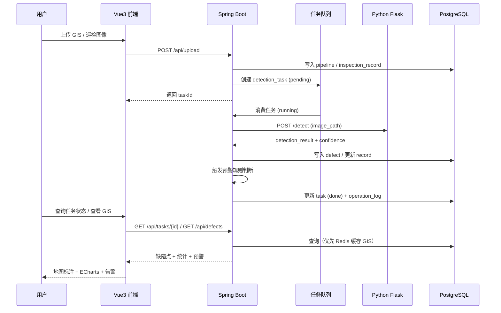
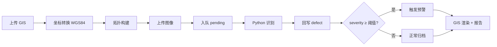

# 水下管线检测与缺陷识别系统 — 产品文档

> 版本：v1.0  
> 适用对象：产品评审、开发实施、答辩演示  
> 文档性质：可实施的产品级需求说明

---

## 1. 产品概述

### 1.1 系统背景

本系统用于黄河水域及沿岸水下管线的运行状态监测，主要替代传统人工巡检模式，实现管线结构数据的数字化管理与缺陷自动识别。系统面向水利工程管理单位，解决管线分布复杂、巡检成本高、缺陷发现滞后的问题。

### 1.2 产品定位

| 维度 | 说明 |
|------|------|
| 产品类型 | Java Web 工程化业务系统（非静态展示页） |
| 核心价值 | GIS 空间建模 + 图像识别融合 + 缺陷预警决策 |
| 运行模式 | 数据驱动、异步批处理、全流程审计追踪 |
| 目标用户 | 水利工程管理单位管理员、巡检操作员 |

### 1.3 建设目标

1. 实现管线 GIS 数据与巡检图像的统一接入与治理。
2. 通过规则引擎 + Python 图像识别双通道，自动识别裂缝、腐蚀、断裂等缺陷。
3. 在 GIS 地图上可视化缺陷分布，并生成可导出的风险报告。
4. 基于严重等级阈值触发预警，支持页面通知与日志审计。
5. 支撑 ≥1 万条模拟数据、≥3 年历史记录，满足课程工程化与答辩演示要求。

### 1.4 用户角色

| 角色 | 权限范围 | 典型操作 |
|------|----------|----------|
| 管理员 | 用户管理、系统配置、全量数据读写、预警规则配置 | 创建账号、导入管线、查看全局报表 |
| 普通用户 | 数据上传、任务查询、结果查看、本账号操作日志 | 上传图像、查看 GIS 缺陷、处理预警 |

---

## 2. 系统架构设计

### 2.1 总体架构

系统采用**前后端分离 + 算法服务独立部署 + 异步任务队列**的架构，整体分为四层：

```
┌─────────────────────────────────────────────────────────────────┐
│                     可视化应用层（Vue3 前端）                      │
│   登录/权限 │ GIS 地图 │ ECharts 统计 │ 预警中心 │ 风险报告        │
└────────────────────────────┬────────────────────────────────────┘
                             │ REST / WebSocket（可选）
┌────────────────────────────▼────────────────────────────────────┐
│                   业务服务层（Spring Boot 后端）                   │
│  用户权限 │ 数据接入 │ 数据治理 │ 任务调度 │ 预警决策 │ 日志审计    │
└──────┬──────────────────────────────┬───────────────────────────┘
       │ HTTP                          │ 消息队列（Kafka / 内存队列）
┌──────▼──────────┐            ┌───────▼───────────────────────────┐
│ Python Flask    │            │ 数据存储层                          │
│ 图像识别服务     │            │ PostgreSQL + PostGIS │ Redis 缓存  │
└─────────────────┘            └───────────────────────────────────┘
```

### 2.2 逻辑分层说明

| 层级 | 职责 | 主要组件 |
|------|------|----------|
| 数据接入层 | 接收管线 GIS 数据与巡检图像，提供 REST 上传接口 | UploadController、文件存储、批量导入 |
| 数据治理层 | 坐标统一、去重、空间拓扑构建 | GisService、TopologyService |
| 缺陷分析层 | 规则检测 + 图像 AI 识别双通道 | DetectionTaskService、PythonClient |
| 可视化应用层 | GIS 渲染、缺陷标注、统计报表、预警展示 | Vue3 + Leaflet + ECharts |

### 2.3 部署架构

```
                    ┌──────────────┐
                    │   Nginx      │  静态资源 + 反向代理
                    └──────┬───────┘
           ┌───────────────┼───────────────┐
           ▼               ▼               ▼
    ┌─────────────┐ ┌─────────────┐ ┌─────────────┐
    │  Vue3 前端   │ │ Spring Boot │ │ Flask 识别   │
    │  :5173/80   │ │   :8080     │ │   :5000     │
    └─────────────┘ └──────┬──────┘ └─────────────┘
                           │
              ┌────────────┼────────────┐
              ▼            ▼            ▼
       ┌───────────┐ ┌──────────┐ ┌──────────┐
       │ PostgreSQL│ │  Redis   │ │ 文件存储  │
       │ + PostGIS │ │  :6379   │ │ /uploads │
       └───────────┘ └──────────┘ └──────────┘
```

### 2.4 核心交互时序



### 2.5 异步处理模式

图像识别任务采用异步处理，状态流转如下：

```
pending → running → done
                  ↘ failed
```

- **pending**：任务已入队，等待消费。
- **running**：Python 识别服务处理中。
- **done**：结果已回写数据库，可触发预警与 GIS 渲染。
- **failed**：识别失败，记录错误信息，支持重试。

---

## 3. 功能模块设计

系统必须包含作业要求的 **6 大工程模块**，映射到本课题如下：

### 3.1 用户与权限模块

| 功能编号 | 功能名称 | 功能描述 | 优先级 |
|----------|----------|----------|--------|
| AUTH-01 | 用户注册 | 管理员创建账号或开放注册（可配置） | P0 |
| AUTH-02 | 用户登录 | 账号密码登录，JWT/Session 鉴权 | P0 |
| AUTH-03 | 角色权限 | 管理员 / 普通用户；接口级 RBAC 控制 | P0 |
| AUTH-04 | 用户管理 | 管理员查看、禁用、重置密码 | P1 |

**页面**：登录页、用户管理页（管理员）

### 3.2 数据接入模块

| 功能编号 | 功能名称 | 功能描述 | 优先级 |
|----------|----------|----------|--------|
| DATA-01 | GIS 数据上传 | 支持 GeoJSON、Excel 批量导入管线数据 | P0 |
| DATA-02 | 巡检图像上传 | 支持单文件、压缩包批量上传 | P0 |
| DATA-03 | 异步上传 | 大文件分片/异步上传，返回任务 ID | P0 |
| DATA-04 | 模拟数据生成 | 一键生成 ≥1 万条管线节点与检测记录 | P0 |
| DATA-05 | 接入日志 | 每次导入记录操作人、文件名、条数、结果 | P0 |

**页面**：数据导入页、上传任务列表页

### 3.3 数据存储模块

| 功能编号 | 功能名称 | 功能描述 | 优先级 |
|----------|----------|----------|--------|
| STORE-01 | 空间数据存储 | PostgreSQL + PostGIS 存储管线几何与缺陷坐标 | P0 |
| STORE-02 | 历史数据归档 | 所有业务表含时间字段，支持 ≥3 年历史查询 | P0 |
| STORE-03 | 文件存储 | 图像文件本地/OSS 路径统一管理 | P0 |
| STORE-04 | Redis 缓存 | 缓存高频 GIS 查询、统计聚合结果 | P1 |

### 3.4 业务处理模块（核心）

| 功能编号 | 功能名称 | 功能描述 | 优先级 |
|----------|----------|----------|--------|
| BIZ-01 | 坐标系转换 | 统一转换为 WGS84（EPSG:4326） | P0 |
| BIZ-02 | 数据去重 | 按管线编号/坐标容差去重 | P0 |
| BIZ-03 | 拓扑构建 | 构建节点-边结构，关联管线分段 | P0 |
| BIZ-04 | 规则检测 | 基于管径、材质、年限等规则辅助判定风险 | P0 |
| BIZ-05 | 图像 AI 识别 | 调用 Python Flask 服务识别裂缝/腐蚀/断裂 | P0 |
| BIZ-06 | 双通道融合 | 规则结果与 AI 结果加权/投票融合 | P1 |
| BIZ-07 | 任务调度 | 队列消费、状态更新、失败重试 | P0 |

**分析逻辑（满足作业复杂度要求）**：

- **分类模型**：图像缺陷类型分类（规则 + ML/模拟模型）
- **异常检测**：同管线历史置信度偏离检测
- **多源融合**：GIS 空间数据 + 图像识别结果关联

### 3.5 可视化模块

| 功能编号 | 功能名称 | 功能描述 | 优先级 |
|----------|----------|----------|--------|
| VIS-01 | GIS 地图 | Leaflet 渲染管线、缺陷点图层叠加 | P0 |
| VIS-02 | 缺陷标注 | 点击缺陷点展示类型、等级、置信度、图像 | P0 |
| VIS-03 | 统计图表 | ECharts 展示缺陷类型分布、趋势、等级占比 | P0 |
| VIS-04 | 风险报告 | 按区域/时间段生成报告，支持导出 PDF/Excel | P1 |
| VIS-05 | 任务看板 | 展示 pending/running/done 任务统计 | P0 |

**页面**：GIS 监控大屏、统计分析页、报告页

### 3.6 预警/决策模块

| 功能编号 | 功能名称 | 功能描述 | 优先级 |
|----------|----------|----------|--------|
| ALERT-01 | 阈值判断 | severity_level ≥ 配置阈值（默认 4）触发预警 | P0 |
| ALERT-02 | 异常检测 | 同一 pipeline 短期缺陷数突增检测 | P0 |
| ALERT-03 | 页面告警 | 预警中心列表、未读标记、详情跳转 GIS | P0 |
| ALERT-04 | 日志告警 | 写入 alert_record 与 operation_log | P0 |
| ALERT-05 | 实时推送 | WebSocket 推送新预警（加分项） | P2 |

**页面**：预警中心、预警规则配置（管理员）

### 3.7 功能模块总览

```
水下管线检测与缺陷识别系统
├── 用户与权限模块
│   ├── 登录 / 注册
│   └── 角色权限（管理员 / 普通用户）
├── 数据接入模块
│   ├── GIS 上传（GeoJSON / Excel）
│   ├── 图像上传（单文件 / 压缩包）
│   └── 模拟数据生成器
├── 数据存储模块
│   ├── PostgreSQL + PostGIS
│   └── Redis 缓存
├── 业务处理模块
│   ├── 坐标转换 / 去重 / 拓扑构建
│   ├── 规则检测
│   └── Python 图像识别（异步队列）
├── 可视化模块
│   ├── Leaflet GIS 地图
│   └── ECharts 统计报表
└── 预警/决策模块
    ├── 阈值判断 / 异常检测
    └── 页面告警 + 日志记录
```

---

## 4. 核心业务流程

系统运行流程分为 **8 个严格步骤**，每一步均需记录日志以支持审计追踪：

| 步骤 | 流程 | 负责模块 | 产出 |
|------|------|----------|------|
| 1 | 用户上传管线 GIS 数据（GeoJSON 或 Excel） | 数据接入 | pipeline 记录 |
| 2 | 系统进行坐标系转换（WGS84 统一） | 业务处理 | 标准化坐标 |
| 3 | 构建管线拓扑关系（节点-边结构） | 业务处理 | 拓扑关联 |
| 4 | 上传巡检图像（压缩包或单文件） | 数据接入 | inspection_record |
| 5 | 图像进入队列（Kafka 或内存队列模拟） | 业务处理 | detection_task(pending) |
| 6 | Python 识别服务执行裂缝/破损检测 | 业务处理 | AI 识别结果 |
| 7 | 检测结果回写 Java 后端数据库 | 业务处理 | defect 记录 |
| 8 | GIS 端渲染缺陷点并生成风险报告 | 可视化 + 预警 | 地图标注 + 报告 + 告警 |



---

## 5. 技术栈

### 5.1 技术选型总表

| 层次 | 技术 | 版本建议 | 用途 |
|------|------|----------|------|
| 后端框架 | Spring Boot | 2.7.x / 3.x | REST API、业务逻辑、任务调度 |
| ORM | MyBatis-Plus | 3.5.x | 数据访问 |
| 接口文档 | Swagger / Knife4j | 3.x | API 文档 |
| 数据库 | PostgreSQL | 14+ | 业务数据存储 |
| 空间扩展 | PostGIS | 3.x | 管线几何、空间查询 |
| 缓存 | Redis | 6.x / 7.x | GIS 查询缓存、会话（可选） |
| 消息队列 | Kafka / 内存队列 | — | 图像识别异步任务 |
| 算法服务 | Python + Flask | 3.x | 缺陷图像识别 |
| 前端框架 | Vue3 + Vite | 3.x | SPA 应用 |
| UI 组件 | Element Plus | 2.x | 表单、表格、布局 |
| GIS | Leaflet | 1.9.x | 地图渲染 |
| 图表 | ECharts | 5.x | 统计分析 |
| HTTP 客户端 | Axios | 1.x | 前后端通信 |
| 反向代理 | Nginx | 1.24+ | 静态资源、API 代理 |
| 实时推送 | WebSocket | — | 预警推送（加分项） |

### 5.2 后端工程结构（建议）

```
backend/
├── controller/      # REST 接口
├── service/         # 业务逻辑
├── mapper/          # MyBatis-Plus DAO
├── entity/          # 实体类
├── dto/             # 请求/响应对象
├── config/          # 安全、Redis、Swagger 配置
├── queue/           # 任务队列消费
├── client/          # Python 服务 HTTP 客户端
└── common/          # 统一响应、异常、日志
```

### 5.3 前端工程结构（建议）

```
frontend/
├── views/           # 页面：登录、GIS、导入、预警、报告
├── components/      # 地图、图表、上传组件
├── api/             # Axios 接口封装
├── router/          # 路由与权限守卫
├── stores/          # Pinia 状态管理
└── utils/           # 工具函数
```

### 5.4 Python 识别服务（建议）

```
python-service/
├── app.py           # Flask 入口
├── detector/        # 检测逻辑（规则 + 模型）
├── models/          # 模型文件（可选 YOLOv8）
└── requirements.txt
```

**识别接口约定**：

```
POST /detect
Request:  { "image_path": "...", "pipeline_id": "..." }
Response: {
  "defect_type": "crack|corrosion|fracture|none",
  "confidence_score": 0.92,
  "severity_level": 3,
  "bbox": [x, y, w, h]
}
```

---

## 6. 数据库设计

### 6.1 设计原则

- 至少 **5 张核心表**，本方案设计 **8 张表**，满足作业全部表类型要求。
- 每张表均有**主键**、**时间字段**、必要**索引**。
- 空间字段使用 PostGIS `GEOMETRY` 类型，支持 WGS84。
- 支持 ≥3 年历史数据存储与按时间范围分析。

### 6.2 表清单

| 序号 | 表名 | 类型归属 | 说明 |
|------|------|----------|------|
| 1 | sys_user | 用户表 | 账号、角色、权限 |
| 2 | pipeline | 数据采集表 | 管线基础与空间数据 |
| 3 | inspection_record | 数据采集表 | 巡检图像记录 |
| 4 | detection_task | 业务分析表 | 异步识别任务 |
| 5 | defect | 业务分析表 | 缺陷标注结果 |
| 6 | alert_record | 结果输出表 | 预警记录 |
| 7 | risk_report | 结果输出表 | 风险报告 |
| 8 | operation_log | 日志/记录表 | 操作与审计日志 |

### 6.3 ER 关系

```
sys_user 1──N inspection_record
sys_user 1──N operation_log
pipeline 1──N inspection_record
pipeline 1──N defect
inspection_record 1──1 detection_task
inspection_record 1──N defect
defect 1──N alert_record
pipeline N──N risk_report（通过 report_detail 关联，可选）
```

### 6.4 表结构详细设计

#### 6.4.1 sys_user（用户表）

| 字段 | 类型 | 约束 | 说明 |
|------|------|------|------|
| id | BIGSERIAL | PK | 用户 ID |
| username | VARCHAR(50) | UNIQUE, NOT NULL | 登录名 |
| password | VARCHAR(255) | NOT NULL | 加密密码（BCrypt） |
| real_name | VARCHAR(50) | | 真实姓名 |
| role | VARCHAR(20) | NOT NULL | admin / user |
| status | SMALLINT | DEFAULT 1 | 1 启用 0 禁用 |
| created_at | TIMESTAMP | NOT NULL | 创建时间 |
| updated_at | TIMESTAMP | | 更新时间 |

**索引**：`uk_username(username)`，`idx_role(role)`

#### 6.4.2 pipeline（管线基础表）

| 字段 | 类型 | 约束 | 说明 |
|------|------|------|------|
| pipeline_id | VARCHAR(64) | PK | 管线编号 |
| pipeline_name | VARCHAR(100) | | 管线名称 |
| geo_coordinates | GEOMETRY(LineString, 4326) | NOT NULL | 空间坐标（WGS84） |
| material_type | VARCHAR(50) | | 材质（钢管/PE/混凝土等） |
| diameter | NUMERIC(8,2) | | 管径（mm） |
| install_time | DATE | | 安装时间 |
| region_code | VARCHAR(20) | | 区域编码 |
| status | SMALLINT | DEFAULT 1 | 1 正常 0 废弃 |
| created_at | TIMESTAMP | NOT NULL | 入库时间 |
| updated_at | TIMESTAMP | | 更新时间 |

**索引**：`idx_pipeline_geom USING GIST(geo_coordinates)`，`idx_material(material_type)`，`idx_install(install_time)`

#### 6.4.3 inspection_record（检测记录表）

| 字段 | 类型 | 约束 | 说明 |
|------|------|------|------|
| record_id | BIGSERIAL | PK | 记录 ID |
| pipeline_id | VARCHAR(64) | FK, NOT NULL | 关联管线 |
| user_id | BIGINT | FK | 上传人 |
| image_path | VARCHAR(500) | NOT NULL | 图像存储路径 |
| image_name | VARCHAR(200) | | 原始文件名 |
| detection_result | VARCHAR(20) | | none/crack/corrosion/fracture |
| confidence_score | NUMERIC(5,4) | | 置信度 0–1 |
| inspect_time | TIMESTAMP | NOT NULL | 巡检时间 |
| created_at | TIMESTAMP | NOT NULL | 入库时间 |

**索引**：`idx_record_pipeline(pipeline_id)`，`idx_inspect_time(inspect_time)`，`idx_detection_result(detection_result)`

#### 6.4.4 detection_task（识别任务表）

| 字段 | 类型 | 约束 | 说明 |
|------|------|------|------|
| task_id | BIGSERIAL | PK | 任务 ID |
| record_id | BIGINT | FK, UNIQUE | 关联检测记录 |
| status | VARCHAR(20) | NOT NULL | pending/running/done/failed |
| retry_count | SMALLINT | DEFAULT 0 | 重试次数 |
| error_message | TEXT | | 失败原因 |
| started_at | TIMESTAMP | | 开始时间 |
| finished_at | TIMESTAMP | | 完成时间 |
| created_at | TIMESTAMP | NOT NULL | 创建时间 |

**索引**：`idx_task_status(status)`，`idx_task_created(created_at)`

#### 6.4.5 defect（缺陷标注表）

| 字段 | 类型 | 约束 | 说明 |
|------|------|------|------|
| defect_id | BIGSERIAL | PK | 缺陷 ID |
| record_id | BIGINT | FK | 关联检测记录 |
| pipeline_id | VARCHAR(64) | FK, NOT NULL | 关联管线 |
| defect_type | VARCHAR(20) | NOT NULL | crack/corrosion/fracture |
| severity_level | SMALLINT | NOT NULL | 严重等级 1–5 |
| location | GEOMETRY(Point, 4326) | | 缺陷空间位置 |
| bbox | VARCHAR(100) | | 图像内标注框 JSON |
| confidence_score | NUMERIC(5,4) | | 置信度 |
| source | VARCHAR(20) | | rule/ai/fusion |
| detected_at | TIMESTAMP | NOT NULL | 检测时间 |
| created_at | TIMESTAMP | NOT NULL | 入库时间 |

**索引**：`idx_defect_pipeline(pipeline_id)`，`idx_defect_type(defect_type)`，`idx_severity(severity_level)`，`idx_defect_geom USING GIST(location)`，`idx_detected_at(detected_at)`

#### 6.4.6 alert_record（预警记录表）

| 字段 | 类型 | 约束 | 说明 |
|------|------|------|------|
| alert_id | BIGSERIAL | PK | 预警 ID |
| defect_id | BIGINT | FK | 关联缺陷 |
| pipeline_id | VARCHAR(64) | FK | 关联管线 |
| alert_level | SMALLINT | NOT NULL | 1–5 |
| alert_type | VARCHAR(30) | NOT NULL | threshold/anomaly |
| alert_message | VARCHAR(500) | | 预警描述 |
| is_read | BOOLEAN | DEFAULT FALSE | 是否已读 |
| triggered_at | TIMESTAMP | NOT NULL | 触发时间 |
| created_at | TIMESTAMP | NOT NULL | 创建时间 |

**索引**：`idx_alert_pipeline(pipeline_id)`，`idx_alert_read(is_read)`，`idx_triggered_at(triggered_at)`

#### 6.4.7 risk_report（风险报告表）

| 字段 | 类型 | 约束 | 说明 |
|------|------|------|------|
| report_id | BIGSERIAL | PK | 报告 ID |
| report_title | VARCHAR(200) | NOT NULL | 报告标题 |
| region_code | VARCHAR(20) | | 区域 |
| start_time | TIMESTAMP | | 统计起始 |
| end_time | TIMESTAMP | | 统计结束 |
| total_defects | INT | | 缺陷总数 |
| high_risk_count | INT | | 高风险数量 |
| report_content | JSONB | | 报告详情 JSON |
| file_path | VARCHAR(500) | | 导出文件路径 |
| created_by | BIGINT | FK | 创建人 |
| created_at | TIMESTAMP | NOT NULL | 生成时间 |

**索引**：`idx_report_region(region_code)`，`idx_report_time(start_time, end_time)`

#### 6.4.8 operation_log（操作日志表）

| 字段 | 类型 | 约束 | 说明 |
|------|------|------|------|
| log_id | BIGSERIAL | PK | 日志 ID |
| user_id | BIGINT | FK | 操作人 |
| module | VARCHAR(50) | NOT NULL | 模块名 |
| operation | VARCHAR(100) | NOT NULL | 操作类型 |
| request_uri | VARCHAR(200) | | 请求路径 |
| request_params | TEXT | | 请求参数 |
| result | VARCHAR(20) | | success/fail |
| error_msg | TEXT | | 错误信息 |
| ip_address | VARCHAR(50) | | 客户端 IP |
| created_at | TIMESTAMP | NOT NULL | 操作时间 |

**索引**：`idx_log_user(user_id)`，`idx_log_module(module)`，`idx_log_created(created_at)`

### 6.5 数据规模要求

| 指标 | 要求 |
|------|------|
| 管线节点 | 1,000 – 20,000 |
| 图像数据 | 每日 1,000 – 5,000 张 |
| 历史记录 | ≥ 3 年 |
| 模拟数据总量 | ≥ 10,000 条 |
| 批量导入 | 支持 GeoJSON / Excel / ZIP |

---

## 7. 接口概要（产品级）

| 模块 | 方法 | 路径 | 说明 |
|------|------|------|------|
| 认证 | POST | /api/auth/login | 登录 |
| 认证 | POST | /api/auth/register | 注册（管理员） |
| 管线 | POST | /api/pipelines/import | 批量导入 GIS |
| 管线 | GET | /api/pipelines | 管线列表/空间查询 |
| 图像 | POST | /api/inspections/upload | 上传巡检图像 |
| 任务 | GET | /api/tasks/{id} | 查询任务状态 |
| 任务 | GET | /api/tasks | 任务列表 |
| 缺陷 | GET | /api/defects | 缺陷列表（支持 GIS 范围筛选） |
| 统计 | GET | /api/statistics/overview | ECharts 统计数据 |
| 预警 | GET | /api/alerts | 预警列表 |
| 预警 | PUT | /api/alerts/{id}/read | 标记已读 |
| 报告 | POST | /api/reports/generate | 生成风险报告 |
| 数据 | POST | /api/mock/generate | 生成模拟数据 |
| 日志 | GET | /api/logs | 操作日志查询 |

> 详细 API 参数与响应体在开发阶段由 Swagger 自动生成并维护。

---

## 8. 非功能性需求

| 类别 | 要求 |
|------|------|
| 性能 | GIS 区域查询响应 ≤ 2s（Redis 缓存命中时 ≤ 500ms） |
| 可用性 | 识别任务失败可重试，不影响其他任务 |
| 安全 | 密码加密存储，接口鉴权，操作全程审计 |
| 可维护 | 前后端分离，Python 服务可独立升级模型 |
| 可扩展 | 支持替换 YOLOv8/Mask R-CNN，扩展数字孪生 |

---

## 9. 可扩展能力

1. **模型升级**：接入 YOLOv8 或 Mask R-CNN，替换当前规则 + 基础模型混合识别模块。
2. **数字孪生**：扩展为管线数字孪生系统，实现实时状态映射与预测性维护。
3. **实时推送**：WebSocket 推送预警与任务完成通知。
4. **大数据量**：分表分库、对象存储、ElasticSearch 检索（未来扩展）。

---

## 10. 验收标准（产品级）

| 编号 | 验收项 | 标准 |
|------|--------|------|
| AC-01 | 工程结构 | 真实 Java Web 工程，非静态页 |
| AC-02 | 六大模块 | 用户权限、数据接入、存储、业务、可视化、预警全部可用 |
| AC-03 | 数据库 | ≥5 张表，主键/索引/时间字段齐全 |
| AC-04 | 核心流程 | 8 步业务流程端到端跑通 |
| AC-05 | 异步识别 | 任务状态 pending/running/done 可查询 |
| AC-06 | GIS 展示 | 管线 + 缺陷点图层叠加 |
| AC-07 | 统计分析 | ECharts 至少 3 种统计图 |
| AC-08 | 预警输出 | 页面告警 + 日志记录 |
| AC-09 | 数据规模 | 模拟数据 ≥1 万条 |
| AC-10 | 演示路径 | 登录 → 导入 → 识别 → 可视化 → 预警 全流程可演示 |

---

## 11. 附录：与作业要求对照

| 作业要求 | 本产品文档对应章节 |
|----------|-------------------|
| 6 大工程模块 | §3 功能模块设计 |
| 数据库 5 表+索引+时间字段 | §6 数据库设计 |
| 技术栈（Spring Boot/Vue3/ECharts） | §5 技术栈 |
| 数据规模 ≥1 万 | §6.5 数据规模要求 |
| 算法/分析逻辑 | §3.4 业务处理模块 |
| 预警/决策 | §3.6 预警/决策模块 |
| 答辩演示路径 | §10 验收标准 |
